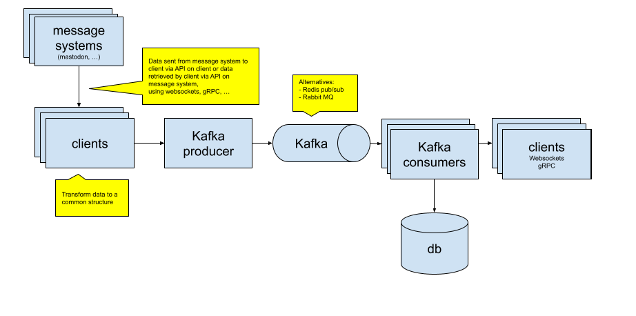

# cocoapeas

# requirements

- Go 1.21.0
- Docker
- Docker Compose
- make

# run

- start Kafka
  - $> make kafka_up
- stop Kafka
  - $> make kafka_down
- start producer and consumer
  - $> make producer
  - $> make consumer

Starting the producer will also start mock clients, one which is Mastodon.

# Architecture
